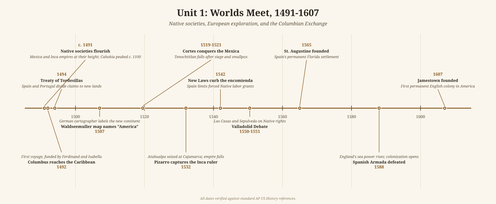

# Unit 1 Review: Worlds Meet, 1491–1607

## The story

In 1491 the Americas held millions of people living in societies as varied as any on earth. Mississippian chiefdoms farmed the river valleys of the Southeast and Midwest — Cahokia, near present-day St. Louis, held tens of thousands of residents at its height around 1100, with earthen mounds that rivaled anything in Europe. In central Mexico the Mexica had built Tenochtitlan, a lake city of hundreds of thousands and the capital of an empire that collected tribute from across Mesoamerica. The Inca ran a still larger empire along the Andes, bound together by roads and storehouses. And across North America, hundreds of smaller societies — Pueblo farmers in the Southwest, Iroquois villagers in the Northeast, fishing peoples of the Pacific Northwest — had each adapted their way of life to a particular environment. The single biggest divide among them was agriculture: where maize farming supported dense populations, complex hierarchies followed; where it did not, life stayed smaller and more mobile.

Europeans arrived for reasons that had little to do with America itself. The Reconquista ended in 1492 when Granada fell, leaving Spain with a crusading military culture and a taste for conquest. Portugal had spent decades perfecting the caravel and creeping down the African coast in search of a sea route to Asian spices. When Columbus sailed west in 1492 with Spanish backing, he was hunting for Asia; across four voyages (1492–1504) he found something that redrew the map instead — literally, when a German cartographer labeled the new continent "America" in 1507.

What followed in the Spanish zone was conquest with astonishing speed. Cortes toppled the Mexica in 1519–1521 and Pizarro seized the Inca ruler in 1532, victories that owed less to a handful of soldiers than to the real weapons: epidemic disease, which killed enormous numbers of Native people who had no immunity, and alliances with Native peoples who had their own reasons to hate the Mexica and Inca. Spain then built an empire on forced labor — the encomienda system — and on silver, above all the great mines at Potosi (1545), whose output flowed into European treasuries and the world economy.

The contact was genuinely two-way, which is why historians call it the Columbian Exchange. Europe received maize, potatoes, tomatoes, cacao, and tobacco — crops that would reshape diets and populations worldwide. The Americas received wheat, sugar, horses, cattle, and pigs — and smallpox, measles, and influenza, which caused a demographic catastrophe among Native peoples.

The brutality of conquest troubled even Spain. Bartolome de las Casas campaigned against Native enslavement, helping win the New Laws of 1542 that curbed the encomienda, and in 1550–1551 he debated Juan Gines de Sepulveda at Valladolid over whether Native peoples possessed natural rights. Spain kept the empire but began replacing Native forced labor with enslaved Africans, imported under the asiento system — a fateful shift.

Other Europeans came later and differently. The French probed the St. Lawrence (Cartier, 1534) and built an empire on fur trade and Native alliances rather than mines and missions. England tried and failed at Roanoke in 1587, then benefited from Spain's weakening after the Armada's defeat in 1588. By 1607, when Jamestown was founded, three European models — Spanish conquest, French trade, English settlement — were all in play, and the hemisphere's Native societies had been permanently, tragically transformed.

## Key terms

- **Columbian Exchange** — the two-way transfer of crops, animals, people, and diseases between the Eastern and Western Hemispheres after 1492.
- **Encomienda** — Spanish grant giving a colonist the right to extract labor and tribute from Native communities, in theory in exchange for Christian instruction.
- **New Laws (1542)** — Spanish reforms, pushed by Las Casas, that limited the encomienda and forbade new grants of Native labor.
- **Valladolid Debate (1550–1551)** — the formal dispute between Las Casas and Sepulveda over the rights and rational humanity of Native peoples.
- **Treaty of Tordesillas (1494)** — the agreement dividing non-European lands between Spain (west of the line) and Portugal (east).
- **Conquistador** — a Spanish conqueror of the early 1500s, such as Cortes or Pizarro, typically seeking gold, glory, and royal favor.
- **Mestizaje and the casta system** — racial mixing in Spanish America and the elaborate legal hierarchy that ranked people by ancestry.
- **Asiento system** — the Spanish monopoly contract for supplying enslaved Africans to the Americas.
- **Bartolome de las Casas** — the Dominican friar whose writings denounced Spanish cruelty and helped curb (but not end) Native enslavement.
- **Cahokia / Mississippian culture** — the maize-farming mound-building societies of the Midwest and Southeast, largest north of Mexico.
- **Mexica (Aztec) Empire** — the tribute empire centered at Tenochtitlan, conquered by Cortes in 1519–1521.
- **Inca Empire** — the Andean empire seized by Pizarro after the capture of its ruler in 1532.
- **Reconquista** — the centuries-long Christian reconquest of Iberia, completed in 1492, which shaped Spain's crusading approach to the Americas.
- **Caravel** — the small, maneuverable Portuguese ship with lateen sails that made long Atlantic voyages possible.
- **St. Augustine (1565)** — the Spanish settlement in Florida, the oldest continuously inhabited European-founded city in the continental United States.
- **Black Legend** — the (partly exaggerated, partly earned) image of Spanish cruelty in the Americas, spread by Spain's rivals.
- **Three Sisters agriculture** — the interplanting of maize, beans, and squash that sustained dense Native populations in eastern North America.

## What the exam tests here

- **Compare Native societies by environment and adaptation** — maize chiefdoms vs. foraging bands vs. the Mexica and Inca empires; the exam rewards linking social complexity to food production, not listing tribes.
- **Causation of the Spanish conquests** — disease and Native alliances mattered as much as guns and steel; strong answers explain all three, not just technology.
- **Compare the three European models** — Spanish conquest and missions, French trade and alliance, English late settlement; this comparison runs through Period 2 as well.
- **The Columbian Exchange as continuity and change** — what moved each direction, and the argument over who gained and who paid: European enrichment and Native demographic catastrophe in one process.
- **Labor systems over time** — from encomienda to the New Laws to African slavery: coerced labor continues, but *who* is coerced changes, with enormous consequences.
- **Conquest was contested at the time** — Las Casas and the Valladolid debate are perfect sourcing material: even in the 1500s, Europeans argued about the morality of empire.
- **Long-run significance** — American silver financed European state power, and the collapse of Native populations opened land and created the labor shortage that drove African slavery.
