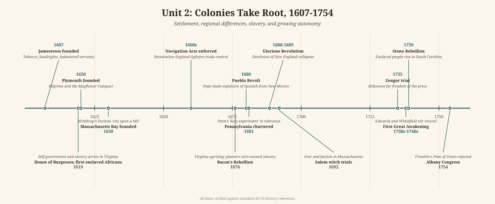

# Unit 2 Review: Colonies Take Root, 1607–1754

## The story

Jamestown began badly. The Virginia Company's settlers arrived in 1607 expecting gold; instead they got the "starving time" of 1609-1610 and appalling death rates. The colony survived because of tobacco - John Rolfe's experiments in the 1610s turned a weed into England's new addiction - and because the company learned to pay people to come: the headright system (1618) granted land to anyone financing a migrant's passage, which meant importing indentured servants for the tobacco fields. In 1619 two arrivals defined Virginia's future: the House of Burgesses, the first elected assembly in English America, and the first enslaved Africans. Self-government and racial slavery were born in the same colony in the same year.

Over the next century the English colonies sorted into four regions the exam will ask you to compare. New England (Massachusetts Bay, 1630) was built by Puritan families seeking a "city upon a hill" - town-centered, church-governed, with small farms, fishing, and trade. The Middle Colonies were diverse from the start: Dutch New Netherland (seized by England in 1664) became New York; Pennsylvania (chartered 1681) was William Penn's "holy experiment" in tolerance, drawing Germans and Scots-Irish to wheat fields. The Chesapeake ran on tobacco and, increasingly, enslaved labor. The Lower South - South Carolina's rice plantations, Georgia (1733) - became the most slave-dependent; by the early 1700s enslaved people outnumbered free whites in South Carolina.

The hardening of slavery is the period's darkest through-line. Early on, the line between servant and slave was blurry. Then came Bacon's Rebellion in 1676: Virginia's poor - black and white, servant and free - rose against the governor, and many historians argue the planter elite drew a lesson from it, shifting decisively toward enslaved African labor that could never claim English liberties. The legal trend is unmistakable either way: Virginia's comprehensive slave codes (1705), South Carolina's harsher code after the Stono Rebellion of 1739, and the New York conspiracy trials of 1741 show a system being locked down by law. Resistance was constant, and the Germantown Quaker petition of 1688 shows moral opposition existed from the start, even if it changed nothing for a century.

Meanwhile the colonies' relationship with England loosened in practice even as it tightened on paper. The Navigation Acts (1660s) reserved colonial trade for English ships, and after the Glorious Revolution of 1688-1689 England briefly tried direct rule through the Dominion of New England (1686-1689) - which collapsed. Thereafter London mostly practiced "salutary neglect," leaving assemblies to grow confident and merchants to grow rich on imported English goods. Colonists became more English in taste and more American in politics at the same time.

Two cultural earthquakes remade colonial minds. The First Great Awakening (1730s-1740s) - Jonathan Edwards's sermons, George Whitefield's revivals - told ordinary people they could experience God directly, splitting churches into Old and New Lights and teaching distrust of established authority. The Enlightenment told them to trust reason instead: Franklin's experiments, his American Philosophical Society (1743), and the Zenger trial (1735), a milestone for freedom of the press. Revival and reason pointed in different directions, but both undermined deference - and both would feed the Revolution.

Beyond England's colonies, the imperial map mattered. Spain held Florida (St. Augustine, 1565) and New Mexico (Santa Fe, 1610) through missions - until the Pueblo Revolt of 1680 drove the Spanish out for over a decade. France built a different empire: Quebec (1608), fur traders and Jesuits ranging inland, New Orleans founded in 1718. By 1754 these empires were on a collision course in the Ohio Valley, and the colonies England had neglected were about to demand attention.

## Key terms

- **Joint-stock company** — a business whose investors shared profits and risks; the Virginia Company (1606) financed Jamestown this way.
- **Headright system** — Virginia's grant of 50 acres to anyone paying for a migrant's passage, which fueled indentured servitude.
- **Indentured servitude** — contracted labor, typically 4–7 years, that supplied most of the Chesapeake's workforce before slavery dominated.
- **House of Burgesses (1619)** — Virginia's elected assembly, the first representative body in English America.
- **Bacon's Rebellion (1676)** — the Virginia uprising of servants, slaves, and poor farmers against Governor Berkeley; many historians see it as a turning point toward racial slavery.
- **Slave codes** — colonial laws (Virginia 1705, South Carolina 1740) that defined enslaved people as property and stripped away legal rights.
- **Middle Passage** — the brutal Atlantic crossing of the transatlantic slave trade, with horrific mortality.
- **Triangular trade** — the three-way Atlantic commerce linking Europe, Africa, and the Americas in goods, enslaved people, and plantation products.
- **Stono Rebellion (1739)** — the South Carolina uprising of enslaved people, the largest in the mainland colonies before the Revolution.
- **Pueblo Revolt (1680)** — the coordinated Native uprising under Pope that expelled Spanish colonists and missionaries from New Mexico.
- **Navigation Acts** — English laws (beginning 1651, tightened in the 1660s) requiring colonial trade to use English ships and pass through English ports.
- **Salutary neglect** — Britain's long habit of loosely enforcing its colonial trade and governance laws, which let assemblies grow powerful.
- **Dominion of New England (1686–1689)** — James II's attempt to consolidate the northern colonies under one royal governor; it collapsed after the Glorious Revolution.
- **Glorious Revolution (1688–1689)** — the overthrow of James II; colonists used it to justify restoring their charters and assemblies.
- **Great Awakening** — the 1730s–1740s religious revivals (Edwards, Whitefield) that emphasized personal conversion and challenged established churches.
- **Enlightenment (American)** — the spread of reason- and science-centered thinking, exemplified by Franklin, which questioned traditional authority.
- **Zenger trial (1735)** — the seditious-libel acquittal of printer John Peter Zenger, a landmark for freedom of the press.
- **Mercantilism** — the economic doctrine that colonies existed to enrich the mother country through a favorable balance of trade.

## What the exam tests here

- **Compare the four regions** — New England, Middle, Chesapeake, Lower South — on economy, labor system, religion, and demographics; this is the single most-tested comparison in the period.
- **Causation of slavery's growth** — plantation economics, the aftermath of Bacon's Rebellion, and legal codification working together; strong answers layer causes rather than picking one.
- **Compare European colonial models** — Spanish missions and conquest, French trade and alliance, Dutch commerce, English settler colonies; each produced a different society.
- **Imperial control vs. colonial autonomy** — Navigation Acts and the Dominion on one side, salutary neglect and powerful assemblies on the other; the tension is the bridge into Period 3.
- **Culture as evidence of a new identity** — the Awakening taught distrust of authority, the Enlightenment taught confidence in reason; the exam asks how ideas shaped action.
- **Resistance from below** — Stono, the Pueblo Revolt, and slave codes as cause-and-effect pairs: repression and resistance escalating together.
- **Continuity and change** — fragile, dependent outposts in 1607 become populous, prosperous, self-governing societies by 1754, yet still loyal to Britain; the exam asks what changed and what did not.
