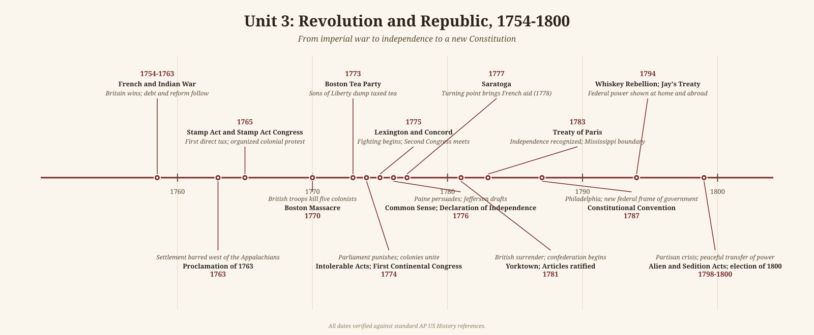

# Unit 3 Review: Revolution and Republic, 1754–1800

## The story

The French and Indian War (1754-1763) was the hinge of American history. Britain beat France for the continent, taking Canada and all French land east of the Mississippi (Spain took New Orleans and the west). Victory left Britain with enormous debt and vast new territory - the combination behind every crisis that followed. After Pontiac's uprising, London issued the Proclamation of 1763 barring settlement west of the Appalachians; to pay the debt, Parliament taxed the colonies directly for the first time: the Sugar Act (1764), then the Stamp Act (1765).

The colonists answered with a new theory: no taxation without representation, grounded in natural rights. Resistance escalated: the Stamp Act Congress (1765) and boycotts forced repeal; the Townshend duties (1767) brought more boycotts; the Boston Massacre (1770) became propaganda; Committees of Correspondence linked the colonies; the Boston Tea Party (1773) provoked the Intolerable Acts (1774); the First Continental Congress (1774) united them. When fighting broke out at Lexington and Concord in April 1775, the Second Continental Congress was already organizing a war.

Independence needed an argument. Paine's *Common Sense* (January 1776) persuaded readers that monarchy itself was the problem; the Declaration of Independence (July 4, 1776) fused Enlightenment philosophy - "all men are created equal" - to a long list of the king's abuses.

The war was won by endurance and alliance. Washington kept an army in the field through Valley Forge (1777-1778); Saratoga (October 1777) brought France's 1778 alliance, with money, troops, and a navy; Yorktown (October 1781) ended major fighting, and the 1783 Treaty of Paris recognized independence with the Mississippi as the boundary. The Revolution cracked the old order at home: Dunmore's 1775 offer of freedom to enslaved people who joined the British forced slavery into the open, Northern states began gradual emancipation, and Abigail Adams's "remember the ladies" asked why liberty stopped at women.

Governing proved harder than winning. The Articles of Confederation, ratified in 1781, created a league of states with no power to tax and no executive - and it showed: Congress could not pay debts or stop Shays' Rebellion (1786-1787). The Constitutional Convention of 1787 produced a federal system sealed with the compromises the exam always probes: the Great Compromise (House by population, Senate by equal states) and the Three-Fifths Compromise, which counted enslaved people for representation while protecting slavery. The Federalist Papers argued the case, Anti-Federalists demanded protections, and the promised Bill of Rights closed the deal.

Washington's choices set precedents. Hamilton's financial plan - assuming state debts, the Bank of the United States (1791), protective tariffs - built national credit. The Neutrality Proclamation (1793) kept America out of the Anglo-French war. Crushing the Whiskey Rebellion (1794) proved the federal government could enforce its laws. Diplomacy scored too: Jay's Treaty (1794) settled leftover issues with Britain, Pinckney's Treaty (1795) won Mississippi navigation rights from Spain, and the Treaty of Greenville (1795) opened Ohio.

But unity did not last. Hamilton's program split the founders into Federalists and Democratic-Republicans. Under John Adams the split turned poisonous: the XYZ Affair (1798) and the undeclared Quasi-War fed the Alien and Sedition Acts (1798), criminalizing criticism of the government. Jefferson and Madison answered with the Kentucky and Virginia Resolutions (1798-1799) - nullification in Kentucky's draft, interposition in Virginia's - planting the states'-rights argument that haunted American politics for generations. The election of 1800 settled it peacefully: Adams lost, Jefferson won, power changed parties without bloodshed. The republic survived its first stress test, though its founding contradiction endured: the cotton gin (1793) made slavery more profitable even as the Northwest Ordinance (1787) barred it from the Old Northwest.

## Key terms

- **French and Indian War (1754–1763)** — the North American theater of the Seven Years' War; Britain's victory created the debt and territory that triggered the imperial crisis.
- **Proclamation of 1763** — Britain's ban on colonial settlement west of the Appalachians, meant to avoid Native wars and resented by land-hungry colonists.
- **Stamp Act (1765)** — Parliament's first direct tax on the colonies, on printed materials; repealed after boycotts and the Stamp Act Congress.
- **Intolerable (Coercive) Acts (1774)** — Parliament's punishment of Massachusetts for the Tea Party, including closing Boston's port and curbing town meetings.
- **Common Sense (1776)** — Thomas Paine's pamphlet arguing for independence and republican government in plain language.
- **Declaration of Independence (1776)** — Jefferson's statement of Enlightenment principles and colonial grievances, adopted July 4.
- **Articles of Confederation** — the first American government (ratified 1781): a weak league of states with no taxing power or executive.
- **Shays' Rebellion (1786–1787)** — the Massachusetts farmers' uprising that exposed the Articles' weakness and pushed elites toward a stronger government.
- **Great Compromise** — the Convention's deal for a bicameral Congress: House seats by population, Senate seats equal per state.
- **Three-Fifths Compromise** — the agreement counting enslaved people as three-fifths of a person for representation and taxation.
- **Federalist Papers** — the pro-Constitution essays by Madison, Hamilton, and Jay, written as "Publius" to win ratification.
- **Bill of Rights** — the first ten amendments (ratified 1791), added to secure Anti-Federalist support for the Constitution.
- **Hamilton's financial plan** — assumption of state debts, the Bank of the United States (1791), and tariffs to build national credit and industry.
- **Whiskey Rebellion (1794)** — the western Pennsylvania tax revolt Washington crushed, demonstrating federal authority.
- **Jay's Treaty (1794)** — the agreement settling postwar issues with Britain (forts, debts, trade); Democratic-Republicans hated its pro-British tilt.
- **Alien and Sedition Acts (1798)** — Federalist laws lengthening naturalization and criminalizing criticism of the government during the Quasi-War.
- **Virginia and Kentucky Resolutions (1798–1799)** — Madison's and Jefferson's states'-rights response to the Sedition Act: interposition and nullification.
- **Election of 1800 ("Revolution of 1800")** — Jefferson's victory over Adams, the first peaceful party transfer of power in the republic.

## What the exam tests here

- **The master causation chain** — Seven Years' War → British debt → imperial reform (taxes, Proclamation) → colonial resistance → independence; nearly every Period 3 question hangs on some link of this chain.
- **Compare the two sides' arguments** — Parliament's claim of virtual representation and imperial authority vs. the colonial claim of actual representation and natural rights; boycotts as economic warfare that made the argument bite.
- **Compare the Articles and the Constitution** — what failed under the first (taxation, enforcement, Shays'), what the second fixed, and what the fixes cost: the slavery compromises.
- **Federalist vs. Anti-Federalist, then Federalist vs. Democratic-Republican** — the ratification debate and the first party system as one continuous argument about federal power, recurring in the Virginia and Kentucky Resolutions.
- **Continuity amid revolution** — slavery survives and even expands (cotton gin, 1793) while Northern states emancipate gradually; the exam asks how revolutionary ideals and racial slavery coexisted.
- **Precedents and peaceful transfer** — Washington's neutrality, the two-term example, and above all the election of 1800: the republic proved it could change rulers without violence.
- **Foreign policy under pressure** — neutrality tested by the French alliance, Genêt, Jay's Treaty, and the XYZ/Quasi-War crisis; Pinckney's Treaty as the western payoff of staying out of Europe's wars.
