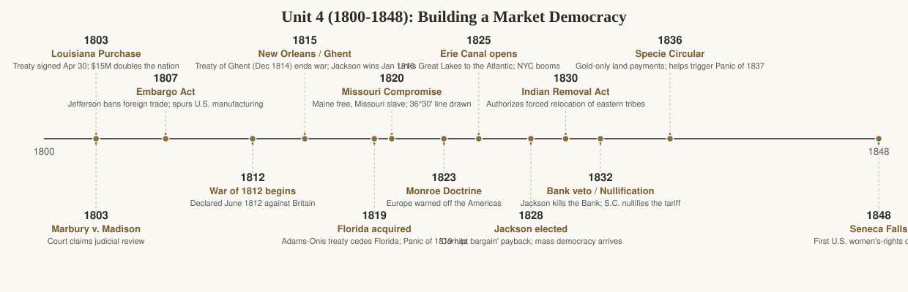

# Unit 4 Period Review (1800–1848): Building a Market Democracy

## The story

When Thomas Jefferson took office in 1801, he inherited a small coastal republic of about five million people, most of them farmers who rarely traveled more than a few miles from home. By 1848, when his successors closed this period, the United States stretched to the Pacific in imagination if not yet in fact, its population topped twenty million, and ordinary white men were voting in numbers that would have shocked the founders. The story of this period is how America built the two great engines of its future — a market economy and a mass democracy — and how both engines ran on the labor and land of people they excluded.

The economic transformation came first. Jefferson's own policies helped trigger it against his intentions: his 1807 Embargo Act, meant to punish Britain and France, cut Americans off from British manufactured goods and forced them to make their own. The War of 1812 did the same thing more dramatically. When the war ended, a wave of national pride and new factories produced what Americans called the Market Revolution. Canals like the Erie (completed 1825), steamboats, turnpikes, and the first railroads tied distant regions into one commercial web. In Lowell, Massachusetts, young women left farms to tend power looms for cash wages — a brand-new way of life. In the Southwest, after the federal government forced Native peoples off their land, enslaved laborers grew cotton for British textile mills, and "King Cotton" made the South the richest agricultural region on earth. The same revolution that enriched the nation deepened the divide between a North moving toward wage labor and a South doubling down on slavery.

The political transformation followed. Property requirements for voting fell away state by state, and the bitter "corrupt bargain" election of 1824 — when the House handed John Quincy Adams the presidency over Andrew Jackson despite Jackson's popular plurality — convinced ordinary voters the system was rigged for elites. Jackson's 1828 victory swept in a new style of politics: mass parties, campaign rallies, and the spoils system, which rewarded supporters with government jobs. But Jacksonian "democracy" had hard limits. Jackson vetoed the recharter of the Second Bank of the United States in 1832, crushed South Carolina's nullification of the tariff in the 1832–33 crisis, and pushed through the Indian Removal Act of 1830, which led to the Trail of Tears (1838–39) — the forced march that killed thousands of Cherokee and other southeastern peoples. His Specie Circular of 1836, demanding gold for land purchases, helped trigger the Panic of 1837, proving that a "common man's" president could still wreck the economy ordinary people depended on.

Meanwhile a religious revival, the Second Great Awakening, convinced thousands of Americans that society itself could be perfected. Reformers launched crusades against alcohol, for public schools (Horace Mann in Massachusetts), for humane treatment of the mentally ill (Dorothea Dix), and — most explosively — against slavery. William Lloyd Garrison's *Liberator* (first published 1831) demanded immediate abolition, not gradual compromise. In 1848, at Seneca Falls, New York, Elizabeth Cady Stanton and Lucretia Mott held the first women's-rights convention and issued a Declaration of Sentiments modeled on the Declaration of Independence. The period ends where it does for a reason: the Mexican War's new western lands, won in 1848, would immediately force the question the Missouri Compromise of 1820 had only postponed — would slavery expand? — and that question would tear the democracy Jackson built nearly apart.

## Key terms

- **Louisiana Purchase (1803)** — Jefferson's $15 million buy from France that doubled the nation's territory.
- **Marbury v. Madison (1803)** — Supreme Court decision establishing judicial review of federal laws.
- **Embargo Act (1807)** — Jefferson's ban on foreign trade; backfired economically but spurred domestic manufacturing.
- **War of 1812 (1812–1815)** — Second war with Britain; ended in stalemate but fueled nationalism and industry.
- **Market Revolution** — The shift to commercial agriculture, wage labor, and regionally linked markets via canals, steamboats, and rail.
- **Erie Canal (1825)** — Waterway linking the Great Lakes to New York City; made New York the commercial capital.
- **Lowell system** — Factory-town model employing young farm women; symbol of early industrial wage labor.
- **Missouri Compromise (1820)** — Admitted Maine free and Missouri slave; banned slavery north of 36°30′ in the Louisiana territory.
- **Monroe Doctrine (1823)** — U.S. warning against new European colonization in the Americas.
- **"Corrupt bargain" (1824)** — Jackson supporters' charge that Adams won the presidency through a House deal with Henry Clay.
- **Spoils system** — Jackson's practice of replacing federal officeholders with political supporters.
- **Nullification crisis (1832–1833)** — South Carolina's attempt to void the federal tariff; Jackson threatened force and Congress compromised.
- **Bank War** — Jackson's 1832 veto of the Second Bank's recharter and removal of federal deposits to state "pet banks."
- **Indian Removal Act (1830)** — Law authorizing forced relocation of eastern tribes west of the Mississippi.
- **Trail of Tears (1838–1839)** — Forced Cherokee removal in which thousands died on the march to Oklahoma.
- **Second Great Awakening** — Evangelical revival wave of the 1820s–30s that inspired reform crusades.
- **Seneca Falls Convention (1848)** — First U.S. women's-rights meeting; issued the Declaration of Sentiments.
- **Cult of domesticity** — Ideal that respectable women belonged in the home, shaping middle-class gender roles amid women's growing public activism.

## What the exam tests here

- **Causation: how the Market Revolution happened.** The exam loves chains like: Embargo Act / War of 1812 cut off British goods → domestic manufacturing grows → canals, steamboats, and railroads link regions → commercial agriculture and wage labor replace subsistence farming. Be ready to explain each link, not just list them.
- **Comparison: Jeffersonian vs. Hamiltonian visions.** Small-farmer republic with limited government versus energetic national government promoting commerce (Bank, tariff, internal improvements). The exam asks which policies fit which vision — and how Jefferson himself contradicted his (Louisiana Purchase, Embargo).
- **Comparison: Jackson's democracy — who was in, who was out.** White male suffrage expanded and parties became mass organizations, while Native peoples were removed, enslaved people remained property, and women were told politics was not their sphere. Questions probe this contradiction directly.
- **Causation: the nullification crisis and federal power.** Why South Carolina nullified (the 1828 "Tariff of Abominations"), how Jackson responded (Force Bill), and why the Compromise Tariff of 1833 ended it — a classic states'-rights-versus-union chain.
- **Continuity and change in slavery's position.** The Missouri Compromise tried to freeze the issue geographically; the cotton boom after Indian Removal made slavery more profitable and more entrenched. The exam asks how the same economy produced both antislavery reform and slavery's expansion.
- **Comparison: reform movements' methods and goals.** Abolitionists (Garrison's immediatism vs. gradualism), temperance, public schools, women's rights — the exam tests whether you can distinguish what each movement wanted and how the Second Great Awakening's perfectionism connected them.
- **Contextualization: the Panic of 1837.** The exam uses it to test whether you can connect policy (Bank War, Specie Circular, pet banks) to economic consequence — and why voters blamed Jackson's successor Van Buren rather than Jackson.

### Added 2026-10-01: Transcendentalism

As the Second Great Awakening pushed Americans toward reform, a smaller circle of New England intellectuals turned the reforming impulse inward. The transcendentalists — centered in Concord, Massachusetts, around Ralph Waldo Emerson and Henry David Thoreau — argued that institutions (churches, parties, even reform movements) corrupted the individual, and that truth came from self-trust and direct experience of nature rather than tradition. Emerson's 1841 essay "Self-Reliance" made the creed famous: "Trust thyself: every heart vibrates to that iron string." Thoreau put the philosophy into practice, living simply at Walden Pond and publishing Walden in 1854, just after this period closes. His 1849 essay on civil disobedience — written after he spent a night in jail for refusing a poll tax during the Mexican War — argued that conscience outranks law, a principle later abolitionists and civil-rights activists would cite.

Transcendentalism matters for the exam not as a mass movement — it never was one — but as the intellectual fuel of the reform era. The same confidence that the individual could remake himself powered temperance, abolitionism, and women's rights; Emerson's circle included Margaret Fuller, whose 1845 *Woman in the Nineteenth Century* fed the Seneca Falls generation. The movement also shows the Market Revolution's cultural cost: in an age of factories and cash wages, the transcendentalists were protesting a society that measured people by their output.

### Added 2026-10-01: The Hudson River School

After 1815, American cultural nationalism demanded an art that was American rather than European. The Hudson River School — named for the valley whose scenery its founders painted — supplied it. Thomas Cole, an English-born immigrant, founded the movement in the 1820s–30s with vast canvases of the American wilderness: *The Oxbow* (1836) and the five-part *Course of Empire* (1833–36), which warned that empires, like republics, could fall. Later painters like Albert Bierstadt and Frederic Edwin Church carried the style west, painting the Rockies and Sierra Nevada on enormous canvases that toured cities like blockbusters.

The paintings did political work. At a moment when expansionists were selling the West as a promised land, these landscapes taught viewers to see American nature as morally superior to Europe's — grander, purer, providentially assigned to Americans. That vision linked art to Manifest Destiny and to the era's faith in progress: Cole himself worried the wilderness would vanish, making the paintings both celebration and elegy. For the exam, the Hudson River School illustrates how post-War-of-1812 nationalism ran through culture as well as politics and economics: Americans weren't just building canals and voting for Jackson; they were deciding what "American" meant, and the answer was the landscape itself.

### Added 2026-10-01: American literature finds a voice

In 1800, American bookshelves were stocked with British authors; by the 1850s, that had changed. The first generation of professional American writers won domestic audiences by turning American settings and history into literature. Washington Irving's *Sketch Book* (1819–20), with "Rip Van Winkle" and "The Legend of Sleepy Hollow," proved American stories could sell — and be pirated — on both sides of the Atlantic. James Fenimore Cooper's Leatherstocking novels, beginning with *The Pioneers* (1823) and peaking with *The Last of the Mohicans* (1826), made the frontier — and the vanishing Indian, in the era's romantic stereotype — the first distinctively American literary subject.

The break from British models was deliberate. In his 1837 Phi Beta Kappa address "The American Scholar," Emerson called for an intellectual Declaration of Independence, urging Americans to stop imitating Europe. Walt Whitman would answer that call most radically with *Leaves of Grass* (1855), just past this period, but the groundwork was laid here. The exam significance: this literary nationalism was the cultural twin of the era's political and economic nationalism — Monroe Doctrine abroad, Market Revolution at home, and now a literature that insisted American experience deserved its own voice rather than Britain's.
