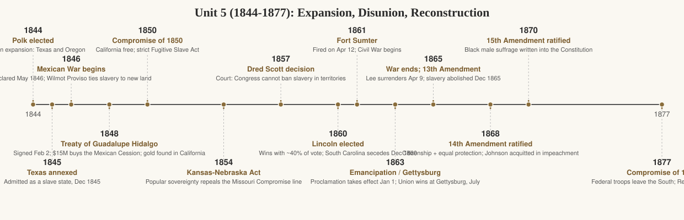

# Unit 5 Period Review (1844–1877): Expansion, Disunion, Reconstruction

## The story

In 1845 a New York editor named John L. O'Sullivan gave the era its slogan: it was America's "manifest destiny" to overspread the continent. James K. Polk won the 1844 election promising exactly that — and delivered. Texas was annexed in 1845, the Oregon boundary settled with Britain at the 49th parallel in 1846, and a war with Mexico (1846–1848) ended with the Treaty of Guadalupe Hidalgo in February 1848. For $15 million the United States took California and the vast Southwest — the Mexican Cession. Weeks earlier, gold had been discovered at Sutter's Mill, and the rush that followed filled California with fortune-seekers almost overnight. In four years the map of North America was redrawn.

But every acre of new land carried the same poisoned question: would slavery expand into it? In 1846 Congressman David Wilmot proposed banning slavery in any territory taken from Mexico. The proviso failed, but it made slavery-in-the-territories the central issue of American politics. The Compromise of 1850 — California admitted free, the rest of the Cession left to popular sovereignty, and a brutal new Fugitive Slave Act — bought a few years of quiet at a terrible price: Northerners were now legally required to help catch runaways, and many who had never cared about abolition became abolitionists out of outrage. Then the Kansas-Nebraska Act of 1854 repealed the Missouri Compromise's 36°30′ line outright, letting settlers vote slavery up or down. Settlers on both sides flooded Kansas and started killing each other — "Bleeding Kansas" — while a new Republican Party organized in 1854 against slavery's expansion. The Supreme Court's Dred Scott decision (1857) declared Congress powerless to ban slavery in the territories and Black people ineligible for citizenship; John Brown's 1859 raid on Harpers Ferry, meant to spark a slave revolt, ended on the gallows but polarized the nation.

The election of 1860 lit the fuse. Abraham Lincoln won with less than 40 percent of the popular vote, carrying no Southern state; within weeks South Carolina seceded, and by February 1861 seven states had formed the Confederacy. When Confederate guns fired on Fort Sumter on April 12, 1861, the war began. After the narrow Union victory at Antietam (September 17, 1862), Lincoln issued the Emancipation Proclamation, effective January 1, 1863 — turning the war into a fight to end slavery and making British or French intervention politically impossible. In July 1863, Gettysburg stopped Lee's northern invasion and Vicksburg gave the Union the Mississippi. Sherman's 1864 march through Georgia broke the South's will, and Lee surrendered at Appomattox on April 9, 1865. Five days later Lincoln was assassinated.

Reconstruction (1865–1877) was America's first great experiment in multiracial democracy — and its first great retreat from one. The 13th Amendment (1865) ended slavery; the Freedmen's Bureau tried to get formerly enslaved people land, schools, and contracts; and the 14th (1868) and 15th (1870) Amendments wrote citizenship, equal protection, and Black male suffrage into the Constitution. For a time it worked: Black men voted, held office, and built schools and churches. But Southern states answered with Black Codes to bind freedpeople to plantation labor, and with terror — the Ku Klux Klan, founded 1866, murdered and intimidated Black voters. Congress impeached Andrew Johnson in 1868 for obstructing Reconstruction (he survived by one Senate vote) and passed the Enforcement Acts (1870–71) to crush the Klan. Yet Northern commitment faded: the Panic of 1873 shifted attention to the economy, and in the disputed election of 1876, the Compromise of 1877 gave the presidency to Rutherford B. Hayes in exchange for withdrawing federal troops from the South. Reconstruction ended not with a bang but with a bargain — and the rights it had promised would wait nearly a century to be redeemed.

## Key terms

- **Manifest Destiny** — O'Sullivan's 1845 claim that the U.S. was destined to spread across North America; justified expansion.
- **Mexican Cession** — The Southwest and California taken from Mexico by the 1848 Treaty of Guadalupe Hidalgo ($15 million).
- **Wilmot Proviso (1846)** — Failed proposal to ban slavery in territory from Mexico; made expansion inseparable from the slavery debate.
- **Compromise of 1850** — Package admitting California free, settling the Texas boundary, and passing a strict Fugitive Slave Act.
- **Fugitive Slave Act (1850)** — Required Northerners to assist in capturing escaped enslaved people; radicalized Northern opinion.
- **Popular sovereignty** — Doctrine that settlers of a territory should vote on slavery; applied in Kansas-Nebraska.
- **Kansas-Nebraska Act (1854)** — Organized the territories on popular sovereignty, repealing the Missouri Compromise line.
- **Bleeding Kansas** — Guerrilla violence between proslavery and antislavery settlers in Kansas Territory, 1854–59.
- **Republican Party (1854)** — New party uniting against slavery's expansion; Lincoln's 1860 vehicle.
- **Dred Scott v. Sandford (1857)** — Court ruled Congress could not ban slavery in territories; Black people could not be citizens.
- **Emancipation Proclamation (1863)** — Lincoln's order freeing enslaved people in Confederate-held territory, effective Jan 1, 1863.
- **Gettysburg (July 1863)** — Three-day battle that ended Lee's northern invasion; the war's military turning point.
- **13th Amendment (1865)** — Abolished slavery throughout the United States.
- **14th Amendment (1868)** — Defined citizenship and guaranteed equal protection and due process.
- **15th Amendment (1870)** — Prohibited denying the vote based on race (in practice, to Black men).
- **Freedmen's Bureau (1865)** — Federal agency aiding formerly enslaved people with food, schools, and labor contracts.
- **Black Codes** — Southern laws restricting freedpeople's movement and labor to recreate plantation discipline.
- **Compromise of 1877** — Deal settling the 1876 election: Hayes got the presidency, federal troops left the South, Reconstruction ended.

## What the exam tests here

- **Causation: how expansion caused disunion.** The chain runs: Mexican Cession → Wilmot Proviso makes slavery a territorial issue → Compromise of 1850 (Fugitive Slave Act radicalizes the North) → Kansas-Nebraska repeals the 36°30′ line → Bleeding Kansas and a purely sectional Republican Party → Dred Scott and Harpers Ferry → secession. The exam expects you to trace it, not just name events.
- **Comparison: the Compromises of 1820, 1850, and the failure of 1860.** Why did geographic lines and package deals work (temporarily) in 1820 and 1850 but fail after 1860? The exam probes what had changed: a sectional party, a Court ruling, and a South that would accept no further restriction.
- **Causation: Lincoln's election as the trigger, not the cause.** The exam distinguishes long-term causes (slavery's expansion, sectional economies, political realignment) from the immediate spark (a Republican winning without a single Southern electoral vote). Be ready to separate them.
- **Continuity and change: the Emancipation Proclamation's two jobs.** It was a military measure (depriving the South of labor) and a diplomatic one (making the war about slavery so Britain and France could not intervene). The exam asks why Lincoln waited until after Antietam and what the proclamation did and did not do (it freed no one in Union-held areas).
- **Comparison: Presidential vs. Congressional (Radical) Reconstruction.** Johnson's lenient restoration plan versus Congress's military Reconstruction, Black Codes versus the 14th Amendment. The exam tests the clash — impeachment included — as a fight over who controlled the peace.
- **Causation: why Reconstruction failed.** Not one cause but several: white Southern terror (KKK), the Supreme Court's narrowing of the amendments, Northern fatigue after the Panic of 1873, and the Compromise of 1877. The exam rewards answers that weigh multiple causes.
- **Contextualization: the amendments' limits.** The 13th, 14th, and 15th Amendments ended slavery and promised equality, yet sharecropping, convict leasing, and later Jim Crow laws showed how rights on paper could be hollowed out. The exam asks what changed immediately and what did not.
