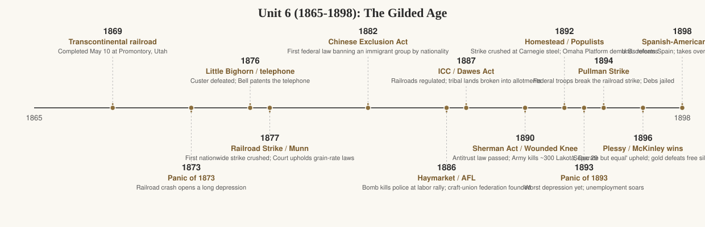

# Unit 6 Period Review (1865–1898): The Gilded Age

## The story

Mark Twain called it the Gilded Age — an era glittering on the surface, base metal underneath. Between the Civil War and 1898, the United States became the world's leading industrial power. The numbers are staggering: railroad track grew from about 35,000 miles in 1865 to over 190,000 by 1900, steel production exploded once the Bessemer process made it cheap in the 1870s, and inventions like Bell's telephone (1876) and Edison's light bulb (1879) rewired daily life. But the deeper story is about power: who controlled the new economy, who did the work, and who got left out.

Control concentrated fast. Railroad barons, oil men like John D. Rockefeller (Standard Oil, 1870), and steel kings like Andrew Carnegie built empires using new corporate weapons — trusts, holding companies, horizontal integration (buying out competitors) and vertical integration (owning every step from mine to market). Prices fell and output soared, but so did the gap between owners and everyone else. The workers who dug the coal, laid the track, and tended the furnaces answered with the first great American labor movement. The Knights of Labor (founded 1869) welcomed the unskilled, women, and Black workers — anyone but bankers, lawyers, and saloonkeepers. When railroad workers struck nationwide in 1877, federal troops crushed them. A bomb at Chicago's Haymarket Square in 1886, thrown during a rally for the eight-hour day, killed police and protesters alike and was used to smash the Knights. The American Federation of Labor (1886), led by Samuel Gompers, took a narrower path: skilled craft unions fighting for wages and hours, not revolution. Defeats piled up — Homestead in 1892, where Carnegie Steel's hired Pinkertons battled locked-out steelworkers, and Pullman in 1894, where the federal government jailed union leader Eugene Debs for stopping the trains. Labor lost nearly every big strike of the era, but it built the organizations and arguments the next century would use.

Meanwhile the population was transforming. "New immigrants" from southern and eastern Europe poured through Ellis Island (opened 1892) into tenements and factories, while nativists demanded restriction — and got it first against the Chinese, whose labor had helped build the western railroads: the Chinese Exclusion Act of 1882 was the first federal law banning immigrants by nationality. Cities swelled, and reformers like Jane Addams, who opened Hull House in Chicago in 1889, tried to humanize the slums with settlement houses. On the Plains, the railroads carried the army's campaigns against Native nations: the Lakota victory at Little Bighorn (1876) was answered with the reservation system, the Dawes Act of 1887, and the massacre at Wounded Knee (1890).

Farmers, squeezed between falling crop prices and railroad freight rates they could not control, organized too. The Grange won state rate laws upheld in Munn v. Illinois (1877); the Farmers' Alliances of the 1880s grew into the People's (Populist) Party, whose 1892 Omaha Platform demanded government ownership of railroads, free coinage of silver, and an income tax. The Panic of 1893 — banks failing, unemployment soaring — seemed to prove them right. But the election of 1896 crushed the movement: Democrat William Jennings Bryan, thundering "you shall not crucify mankind upon a cross of gold," fused with the Populists and lost to Republican William McKinley, whose gold-standard victory settled the money question for a generation. The same year, Plessy v. Ferguson blessed "separate but equal," and Southern states rewrote constitutions to strip Black citizens of the vote — the legal architecture of Jim Crow. The period closes in 1898 with a short, popular war against Spain that left the United States holding the Philippines, Puerto Rico, and Guam: an industrial power had become an empire, and the century's next questions — about workers, race, and America's role in the world — were already waiting.

## Key terms

- **Bessemer process** — Cheap steelmaking method adopted in the 1870s; made skyscrapers, rails, and bridges economical.
- **Trust** — Combination of companies under one board to kill competition and fix prices (e.g., Standard Oil).
- **Vertical / horizontal integration** — Controlling every production stage (Carnegie) versus buying out rivals (Rockefeller).
- **Knights of Labor (1869)** — Industrial union open to the unskilled, women, and Black workers; peaked in the 1880s.
- **Great Railroad Strike (1877)** — First nationwide strike; broken by federal troops, signaling government's pro-business stance.
- **Haymarket affair (1886)** — Chicago bombing at a labor rally; backlash crippled the Knights of Labor.
- **American Federation of Labor (1886)** — Gompers's federation of skilled craft unions focused on wages, hours, and conditions.
- **Homestead Strike (1892)** — Carnegie Steel lockout broken by Pinkertons and state militia; a major union defeat.
- **Pullman Strike (1894)** — Railroad strike broken by federal injunction and troops; Debs jailed, turned to socialism.
- **"New immigrants"** — Southern and eastern Europeans arriving from the 1880s; crowded cities, fueled nativism.
- **Chinese Exclusion Act (1882)** — First federal immigration ban targeting one nationality.
- **Dawes Act (1887)** — Broke reservations into individual allotments; sold the "surplus" to white settlers.
- **Interstate Commerce Act (1887)** — Created the ICC, the first federal regulation of railroads.
- **Sherman Antitrust Act (1890)** — Outlawed restraints of trade; weakly enforced against big business at first.
- **Populist (People's) Party (1892)** — Farmers' party; Omaha Platform demanded silver coinage, railroad regulation, income tax.
- **Election of 1896** — McKinley (gold, industry) beat Bryan (free silver, farmers); realigned politics for a generation.
- **Plessy v. Ferguson (1896)** — Upheld "separate but equal"; legal foundation of Jim Crow segregation.
- **Gospel of Wealth (1889)** — Carnegie's argument that the rich should give fortunes back to society; paired with Social Darwinism's defense of inequality.

## What the exam tests here

- **Comparison: Knights of Labor vs. AFL.** Inclusive industrial unionism (unskilled, women, Black workers, broad reform goals) versus exclusive craft unionism (skilled workers, bread-and-butter demands). The exam asks why the AFL survived Haymarket while the Knights collapsed.
- **Causation: why labor lost the big strikes.** The chain the exam wants: federal troops and injunctions (1877, 1894), employer weapons (Pinkertons, blacklists, lockouts at Homestead), public fear after Haymarket, and courts hostile to unions. Government was not neutral — be ready to show it.
- **Continuity and change: immigration, old and new.** Earlier immigrants (Irish, German) versus "new" immigrants (Italian, Jewish, Slavic) — different origins, same nativist backlash. The exam tests the pattern: economic anxiety plus cultural prejudice producing restriction, climaxing in Chinese Exclusion (1882).
- **Causation: industrialization and the West.** Railroads needed steel; steel needed coal and iron; all three needed the Plains — which meant removing Native nations. The exam loves chains linking technology, business, and the Indian wars (Little Bighorn → reservations → Dawes → Wounded Knee).
- **Comparison: farmers' responses to industrial capitalism.** Grange laws, the Alliances, and Populism were escalating answers to the same problem: farmers produced more but earned less while railroads and banks set the terms. The exam asks how each movement's demands grew bolder.
- **Causation: the money question and 1896.** Why falling prices made debtors love silver and creditors love gold; how the Panic of 1893 made it urgent; why Bryan's "Cross of Gold" fusion with the Populists still lost. The exam treats 1896 as the hinge where industrial America outvoted rural America.
- **Contextualization: Plessy and the end of Reconstruction's promise.** The exam connects the 1890s — disfranchisement constitutions, Jim Crow laws, Plessy — back to the Compromise of 1877: federal abandonment made Southern white supremacy legally safe again.
- **Comparison: the Gilded Age economy — who benefited?** Industrialists' case (growth, lower prices, innovation) versus workers', farmers', and immigrants' case (wages, hours, debt, slums). The exam asks you to hold both arguments and judge with evidence, not slogans.

### Added 2026-10-01: The "New South"

In a famous 1886 address to New York businessmen, Atlanta editor Henry W. Grady preached reconciliation through commerce: "There was a South of slavery and secession — that South is dead. There is a South of union and freedom — that South, thank God, is living, breathing, growing every hour." The New South creed promised that railroads, mills, and Northern capital would industrialize the region and close the wealth gap with the North. Boosters did build real industry — Birmingham's iron and steel, textile mills across the Carolina Piedmont, tobacco factories in North Carolina — and Southern cities grew fast.

The reality fell far short of the promise. Most Southerners stayed poor farmers, trapped by sharecropping and the crop-lien system: landless tenants bought supplies on credit at inflated prices and paid in cotton, ending each year deeper in debt — a cycle critics called wage slavery in a new form. Mill villages were often company towns with wages below Northern levels, and the capital that built them mostly came from the North. Politically, the New South meant white supremacy made legal: starting with Mississippi's 1890 constitution, Southern states rewrote their fundamental laws with poll taxes, literacy tests, and grandfather clauses that stripped Black men of the vote — the same constitutions Plessy v. Ferguson (1896) then protected.

The exam asks the hard question the creed invites: how new was the New South? The economy industrialized only partially, the labor system echoed slavery's coercion, and the region stayed the nation's poorest — proof that abolition had ended slavery without ending its economic logic.

### Added 2026-10-01: The Gilded Age middle class

Industrialization didn't just create millionaires and factory hands; it created a new middle class. As corporations grew, they needed armies of clerks, bookkeepers, managers, salesmen, and stenographers — white-collar workers whose salaries depended on the economy but whose lives no longer involved manual labor. Women, in particular, entered the office workforce in large numbers as typewriters and telephones multiplied. Department stores — Macy's, Marshall Field's, Wanamaker's — and mail-order catalogs (Montgomery Ward, Sears) built the beginnings of a consumer culture: fixed prices, advertising, brand names, and shopping as leisure.

The middle class also changed the map. Electric streetcars let families move to early suburbs — streetcar suburbs — separating home from workplace and making homeownership the class's defining aspiration. With more schooling (high schools expanded rapidly) and more leisure, middle-class Americans filled the audiences for the era's reform energy: women's clubs, temperance unions, and the readers of the muckrakers. That matters for the exam because this class became Progressivism's foot soldiers: the same clerks and professionals who bought department-store goods would, in the 1900s, demand pure food, clean cities, and honest government. The middle class was industrialization's most durable political product — it bought the system's promises, then turned around and tried to fix the system's abuses.

### Added 2026-10-01: Ghost Dance and Wounded Knee (1890)

By the late 1880s the reservation system was strangling Plains peoples: the buffalo were gone, rations were cut, and the Dawes Act was breaking reservations into allotments. In 1889 a Northern Paiute holy man named Wovoka — called Jack Wilson by whites — preached a vision of renewal: if Indians lived righteously and performed the Ghost Dance, the dead would return, the buffalo would come back, and whites would disappear. The Ghost Dance spread like fire across the Plains as spiritual resistance — not a war plan, but a last hope.

Terrified agents and settlers misread it as a war dance. In December 1890, reservation police tried to arrest the Lakota leader Sitting Bull and killed him in the attempt. Days later, on December 29, 1890, the Seventh Cavalry surrounded Big Foot's band of Minneconjou Lakota at Wounded Knee Creek, South Dakota. During the disarmament a shot was fired — accounts differ on who fired first — and the soldiers opened up with rifles and Hotchkiss guns, killing roughly 250–300 Lakota, many of them women and children. Wounded Knee is the conventional endpoint of the Indian wars: organized Native military resistance to the United States effectively ended there.

### Added 2026-10-01: The Dawes Act (1887) — intent vs. outcome

The Dawes Severalty Act embodied the era's assimilationist logic: break reservations into individual allotments (160 acres per head of household), hold them in federal trust for 25 years, declare recipients U.S. citizens, and sell the "surplus" land to white settlers — the theory being that private property would turn Indians into self-sufficient farmers. The outcome was catastrophe. Allotments were too small and dry for Plains agriculture, and much of the best land was declared surplus and sold outright; over the next decades Indians lost roughly two-thirds of their remaining land — from about 138 million acres in 1887 to about 48 million by 1934 — while the reservation map was checkerboarded with white ownership and allotments leased back for pennies. Intended to dissolve tribalism by making Indians into yeoman farmers, allotment instead produced poverty and dependence — and created the desperation in which Wovoka's Ghost Dance took hold. Reformers celebrated allotment as liberation; the acreage figures tell the real story.
