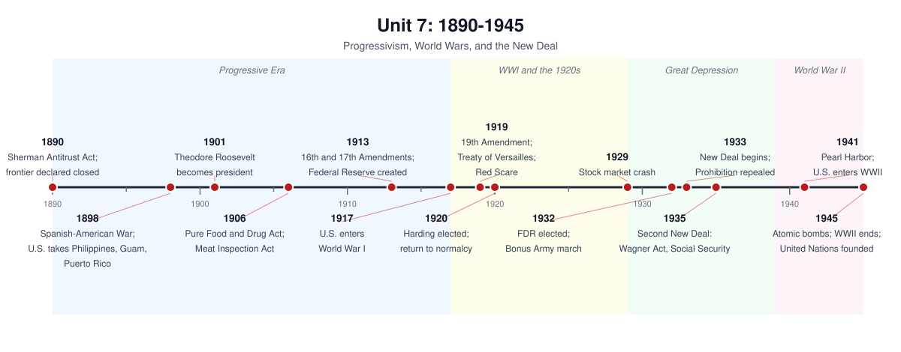

# Unit 7: 1890–1945 — Progressivism, World Wars, and the New Deal

## The story

Between 1890 and 1945 the United States grew from a young industrial nation into a global power — and redefined what the federal government was for.

The period opens in the wreckage of the Gilded Age's promises. Industrialization had made the country rich and unequal at once: giant trusts dominated oil, steel, and railroads; cities swelled with immigrants in tenements; farmers watched crop prices fall while railroad rates rose. The Populists' failed farmer-labor revolt of the 1890s fed the Progressive movement — a middle-class push to turn government against concentrated power. Muckraking exposés of the meatpacking industry produced the Pure Food and Drug Act and Meat Inspection Act of 1906. Theodore Roosevelt turned the presidency into a "bully pulpit": trust-busting under the Sherman Act, millions of acres set aside for conservation, and a federal government refereeing capital and labor. Under Wilson, reform reached finance and democracy itself: the Federal Reserve, the income tax, and direct election of senators — all in 1913. Women won the vote with the 19th Amendment in 1920 after decades of organizing.

But domestic reform went hand in hand with a new assertiveness abroad. The Spanish-American War of 1898 made the United States an empire holding the Philippines, Guam, and Puerto Rico — and ignited debate over whether a republic should rule colonies. Roosevelt built the Panama Canal (1904–1914) and claimed, in his corollary to the Monroe Doctrine, an American right to police the hemisphere. When World War I erupted in 1914, Wilson kept the country neutral until German submarine warfare and the Zimmermann telegram pushed him to ask Congress for war in April 1917. The war showed what the modern state could do — and what it would do to dissent: the Espionage and Sedition Acts jailed critics, and Schenck v. United States (1919) let the Court bless the crackdown. Wilson's dream of a League of Nations died in the Senate, and the country turned inward.

The 1920s looked like triumph: assembly lines, radios, cars, a consumer economy built on credit. Beneath the prosperity ran deep anxieties: the Red Scare of 1919–20, immigration quotas in 1921 and 1924 aimed at southern and eastern Europeans and Asians, the Scopes trial, and the Ku Klux Klan's rebirth as a mass movement. The Harlem Renaissance showed Black culture reshaping American art even as lynching and segregation held firm. Then the October 1929 stock market crash collapsed the credit economy into the Great Depression: by 1933 a quarter of workers were unemployed and banks were failing by the thousands.

Roosevelt's New Deal answered with an unprecedented expansion of federal power: the Hundred Days of 1933, jobs programs, farm supports, banking reform, and — in the Second New Deal (1935) — Social Security and the Wagner Act's protection of union organizing. The New Deal did not end the Depression — wartime spending did — and it left much undone: farm and domestic workers, disproportionately Black and Latino, were excluded from key protections, and FDR's 1937 court-packing plan failed. But it permanently changed expectations: the government now owed its citizens a floor.

After Pearl Harbor (December 7, 1941), the United States mobilized on a vast scale: women flooded factories, African Americans moved north and west in the Second Great Migration and pressed the Double V campaign against fascism abroad and racism at home, and the government interned some 120,000 Japanese Americans — a betrayal the Supreme Court upheld in Korematsu (1944). The Manhattan Project built the atomic bomb; its use on Hiroshima and Nagasaki in August 1945 ended the war and opened the atomic age. The United States emerged the world's richest, most powerful nation — and helped found the United Nations.

## Timeline

*Generated from `timelines/gen_timelines_u789.py` — original graphic, not taken from any book.*

## Key terms

- **Progressivism** — the early-1900s reform movement that used government power to curb big business, clean up cities, and expand democracy.
- **Muckrakers** — investigative journalists whose exposés of corruption and unsafe products built public pressure for Progressive reforms.
- **Trust-busting** — the use of the Sherman Antitrust Act (1890) to break up or restrain monopolies, most aggressively under Theodore Roosevelt.
- **16th Amendment (1913)** — authorized a federal income tax, giving the government a revenue base for its expanding role.
- **Federal Reserve Act (1913)** — created the central banking system to stabilize credit and regulate the money supply.
- **19th Amendment (1920)** — prohibited denying the vote on the basis of sex, the capstone of decades of women's suffrage organizing.
- **American imperialism** — the post-1898 turn to overseas empire, justified by markets, naval strategy, and beliefs about American superiority.
- **Roosevelt Corollary (1904)** — claimed a U.S. right to intervene in Latin America to keep European powers out, extending the Monroe Doctrine.
- **Zimmermann telegram (1917)** — Germany's secret offer of a Mexican alliance against the U.S., which helped push Wilson to ask for war.
- **Fourteen Points (1918)** — Wilson's plan for peace: open diplomacy, self-determination, and a League of Nations.
- **League of Nations** — the international organization at the heart of the Treaty of Versailles; the Senate rejected U.S. membership.
- **Red Scare (1919–1920)** — the postwar panic over communism and anarchism, marked by the Palmer Raids and deportations.
- **Harlem Renaissance** — the 1920s flowering of Black literature, music, and art centered in Harlem, asserting Black cultural identity.
- **Great Depression** — the 1929–1939 economic collapse: mass unemployment, bank failures, and farm ruin after the stock market crash.
- **New Deal** — FDR's program of relief, recovery, and reform that vastly expanded the federal government's economic role.
- **Wagner Act (1935)** — guaranteed workers' right to unionize and bargain collectively; the legal foundation of modern labor unions.
- **Social Security Act (1935)** — created old-age pensions and unemployment insurance, the core of the American welfare state.
- **Japanese American internment** — the wartime forced relocation of some 120,000 Japanese Americans, upheld in Korematsu v. United States (1944).

## What the exam tests here

- **Compare the two wartime home fronts (WWI vs. WWII):** both expanded federal power and curtailed liberties — Espionage/Sedition Acts and Schenck in 1917–18, internment and Korematsu in 1941–45 — but WWII's mobilization was larger and transformed work, migration, and women's roles more deeply.
- **Compare Progressivism and the New Deal:** both grew the federal government, but Progressives aimed mainly at concentrated corporate power and political corruption, while the New Deal built a safety net and managed demand; both left racial exclusions largely intact.
- **Explain the Great Depression's causes:** the exam expects multiple causes — overproduction, farm distress, a fragile banking system, stock speculation on margin, maldistribution of income, and global collapse (including the Smoot-Hawley Tariff's role).
- **Explain why the U.S. entered each world war:** WWI entry rested on submarine warfare, the Zimmermann telegram, and economic ties to the Allies; WWII entry came through Pearl Harbor after escalating embargoes showed the Neutrality Acts had failed.
- **Trace the growth of federal power, 1890–1945:** from TR's referee state through Wilson's wartime management to the New Deal and warfare state — pick one thread (regulating business, providing welfare, managing the economy) and follow it across the whole period.
- **Track nativism as a continuity:** the Red Scare, the 1920s immigration quotas, and wartime suspicion of immigrants recur with different targets; be ready to compare the justifications each time.
- **Debate 1898 (America in the World):** know the arguments for and against imperialism after the Spanish-American War, and why the U.S. kept expanding its global role even while the Senate rejected the League of Nations.
