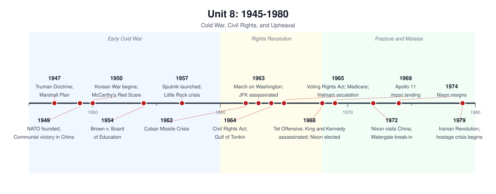

# Unit 8: 1945–1980 — Cold War, Civil Rights, and Upheaval

## The story

From 1945 to 1980 the United States lived inside a contradiction: the richest, most powerful nation in history, terrified of losing everything to communism — and forced, by its own democratic promises, to confront the gap between its ideals and its reality.

The Cold War set the terms. Even before World War II ended, the alliance with the Soviet Union cracked over the future of Eastern Europe. The Truman Doctrine (1947) pledged American support to any nation resisting communism, and containment became U.S. foreign policy's operating system: the Marshall Plan rebuilt Western Europe, NATO (1949) bound America to Europe's defense, and the Korean War (1950–53) proved the United States would fight undeclared wars to stop communist expansion. At home, the same fear produced the Second Red Scare: loyalty programs, HUAC hearings, and Senator Joseph McCarthy's baseless accusations ruined careers until the Army-McCarthy hearings of 1954 broke his spell. The arms race added a new terror: by the 1960s both superpowers could destroy civilization, and the Cuban Missile Crisis of October 1962 brought the world closer to nuclear war than ever before or since.

Domestic life looked like a golden age, and for many white Americans it was. The GI Bill sent millions to college and into new suburban homes; the baby boom, the interstate highway system (1956), and cheap energy built a consumer society around the car and the single-family home. Factory wages supported a family, unions were strong, and both parties accepted that government should smooth capitalism's rough edges. But the prosperity had borders. Suburbs were segregated by redlining and restrictive covenants; the Sun Belt boomed while inner cities decayed; women were pushed back toward domesticity after their wartime work.

The civil rights movement broke the consensus open. Brown v. Board of Education (1954) declared segregated schools unconstitutional, but change came from the ground up: the Montgomery bus boycott (1955–56), the Little Rock Nine (1957), sit-ins (1960), Freedom Rides (1961), and the March on Washington (1963) forced Washington to act. The Civil Rights Act (1964) and the Voting Rights Act (1965) were the most sweeping equality laws since Reconstruction — and they remade American politics, driving white Southerners out of the Democratic Party and toward the Republicans. The movement later fractured — over Black Power, urban uprisings, King's 1968 assassination — but its victories opened doors for every movement that followed: women, Latinos, Native Americans, gay Americans, and people with disabilities all borrowed its strategies.

Johnson's Great Society tried to finish the New Deal's unfinished work — Medicare, Medicaid, federal aid to education, immigration reform — but Vietnam devoured his presidency. Authorized by the Gulf of Tonkin Resolution (1964) and escalated year after year, the war killed over 58,000 Americans and an estimated two million Vietnamese without a plausible path to victory. The Tet Offensive shattered public trust; assassinations, riots, and a chaotic Democratic convention made 1968 the year the postwar consensus died.

Richard Nixon read the wreckage shrewdly: he courted the "silent majority," pursued détente with the Soviets and an opening to China (1972), won a 1972 landslide — then destroyed his presidency covering up the Watergate break-in, resigning in August 1974. The 1970s that followed felt like a long comedown: the OPEC oil embargo (1973) and a second energy crisis (1979) exposed American vulnerability; stagflation — inflation plus unemployment at once — broke the Keynesian toolkit; factories began closing as competition from Japan and West Germany intensified. Carter's "crisis of confidence" speech (1979) named the mood, and the Iranian hostage crisis — 52 Americans held 444 days — televised it. By 1980 a growing conservative movement declared the postwar bargain a failure, and Reagan's election closed the period.

## Timeline

*Generated from `timelines/gen_timelines_u789.py` — original graphic, not taken from any book.*

## Key terms

- **Containment** — the Cold War strategy of blocking Soviet and communist expansion wherever it appeared, rather than rolling it back by force.
- **Truman Doctrine (1947)** — pledged U.S. support to nations resisting communist takeover, beginning with Greece and Turkey.
- **Marshall Plan (1948)** — massive American aid to rebuild Western Europe's economies as a bulwark against communism.
- **NATO (1949)** — the North Atlantic military alliance binding the U.S. to Western Europe's defense against the USSR.
- **McCarthyism / Second Red Scare** — the early-1950s anti-communist panic: loyalty oaths, HUAC hearings, blacklists, and Senator Joseph McCarthy's unsubstantiated accusations.
- **Arms race** — the U.S.-Soviet competition in nuclear weapons and delivery systems, producing the doctrine of mutual destruction.
- **Cuban Missile Crisis (1962)** — the thirteen-day standoff over Soviet missiles in Cuba, the closest the Cold War came to nuclear war.
- **GI Bill (1944)** — gave returning veterans college tuition and low-cost home loans, fueling suburbanization and the middle class.
- **Suburbanization** — the postwar migration to suburbs, driven by highways, cheap land, and federal housing policy — and shaped by racial exclusion.
- **Brown v. Board of Education (1954)** — the Supreme Court decision declaring segregated public schools unconstitutional.
- **Montgomery bus boycott (1955–56)** — the year-long protest, sparked by Rosa Parks's arrest, that desegregated the city's buses and made Martin Luther King Jr. a national leader.
- **Civil Rights Act of 1964** — outlawed segregation in public places and banned employment discrimination.
- **Voting Rights Act of 1965** — suspended literacy tests and authorized federal oversight of elections in the Jim Crow South.
- **Black Power** — the late-1960s movement emphasizing Black self-determination, pride, and economic and political power, challenging the integrationist approach.
- **Great Society** — LBJ's domestic program: Medicare, Medicaid, federal education aid, and the War on Poverty.
- **Gulf of Tonkin Resolution (1964)** — the congressional authorization LBJ used to escalate the Vietnam War without a declaration.
- **Détente** — Nixon's policy of easing tensions with the USSR and China through negotiation and arms-control agreements.
- **Watergate** — the 1972 break-in and cover-up that forced Nixon's resignation in 1974, deepening distrust of the presidency.

## What the exam tests here

- **Compare the two Red Scares (1919–20 vs. the 1950s):** both traded liberty for security, but the second was longer, more institutional (HUAC, loyalty programs, McCarthy), and more entangled with foreign policy.
- **Explain the Cold War's origins:** the exam expects multi-causal answers — Soviet expansion, American economic and security interests, ideology, and misperception — and rewards knowing both the orthodox (Soviet aggression) and revisionist (U.S. economic motives) interpretations.
- **Trace the growth of federal power as continuity and change:** compare the New Deal, the Great Society, and the national-security state — what changed in government's role, and what stayed the same.
- **Compare phases of the civil rights movement:** the early legal and legislative victories (Brown, 1964, 1965) versus the later, harder fight over de facto segregation, economic justice, and Black Power — and why the movement fractured after 1965.
- **Explain Vietnam's escalation:** the Tonkin Resolution, domino theory, credibility, and the self-reinforcing logic of incremental escalation; be ready to explain why "victory" was never defined.
- **Apply containment three ways (America in the World):** Korea, Cuba, and Vietnam were three different applications of the same doctrine — compare how each tested containment and what each revealed about its limits.
- **Treat the 1970s as a pivot:** stagflation, the energy shocks, and deindustrialization ended the postwar boom — connect the economics to the political rise of the New Right and Reagan.
