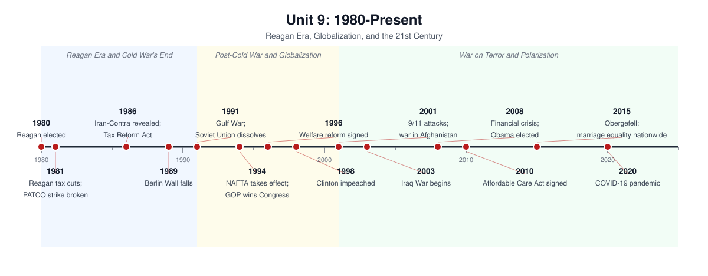

# Unit 9: 1980–Present — Reagan Era, Globalization, and the 21st Century

## The story

The period from 1980 to the present is the story of one American order collapsing, a second one rising and then cracking, and a country still arguing about what comes next.

Ronald Reagan's election in 1980 was a repudiation. He promised to shrink government at home — cutting taxes (1981), slashing regulation, and breaking the PATCO air-traffic controllers' strike to signal that organized labor's power was over — while spending massively on the military abroad. "Reaganomics" rested on supply-side theory: lower taxes would unleash growth that paid for itself. Growth did return, but so did huge deficits and stark inequality. Abroad, Reagan called the Soviet Union an "evil empire," funded anti-communist insurgents, and announced the Strategic Defense Initiative (1983) — then, when Mikhail Gorbachev came to power seeking reform, negotiated seriously, signing the INF Treaty in 1987. The Cold War's endgame came fast: the Berlin Wall fell in November 1989, Germany reunified, and the Soviet Union dissolved in December 1991. America stood alone as the unchallenged superpower, and the 1990s felt like a victory lap: the Gulf War (1991) expelled Iraq from Kuwait in weeks, NAFTA (1994) and the WTO embodied a new faith in globalization, and the tech boom — personal computers, then the internet — delivered the longest expansion on record to that point. Bill Clinton triangulated: a Democrat who declared "the era of big government is over," signed welfare reform (1996), and presided over budget surpluses — then was impeached in 1998 over the Lewinsky scandal and acquitted by the Senate.

The 2000 election, decided by the Supreme Court in Bush v. Gore, left the country evenly and bitterly divided — and then September 11, 2001, reordered everything. The attacks killed nearly 3,000 people and launched the War on Terror: Afghanistan (2001), the Patriot Act's expansion of surveillance, a new Department of Homeland Security, and in 2003 the invasion of Iraq on claims about weapons of mass destruction that proved false. Iraq's long, costly occupation split the country and discredited the neoconservative vision. At home, the housing bubble's collapse in 2008 produced the worst financial crisis since the Depression; the government's bank bailouts (TARP) saved the system and fed a populist fury on both left and right. Barack Obama's election in 2008 — the first Black president — was read by some as a post-racial milestone; his Affordable Care Act (2010) extended health coverage to millions and became the decade's defining political war, fueling the Tea Party revolt.

The 2010s and 2020s have been defined by two currents running together: accelerating social change and deepening polarization. The Supreme Court nationalized same-sex marriage in Obergefell (2015); movements from Occupy to Black Lives Matter to #MeToo showed a new generation organizing outside the old party structures; demographic change — the coming "majority-minority" nation — reshaped politics, especially around immigration. Donald Trump's election in 2016 channeled the backlash: against globalization, against immigration, against the political establishment itself. His presidency, Joe Biden's (2020), and Trump's return in 2024 have all unfolded against institutional distrust, social-media-fueled fragmentation, and unresolved arguments about elections themselves — punctured by real crises: the COVID-19 pandemic, which killed over a million Americans, and the January 6, 2021, attack on the Capitol. The through-line of the whole period is the end of the Cold War consensus about America's role in the world — and the failure, so far, to build a new one.

## Timeline

*Generated from `timelines/gen_timelines_u789.py` — original graphic, not taken from any book.*

## Key terms

- **Reaganomics / supply-side economics** — Reagan's program of tax cuts, deregulation, and domestic spending cuts, built on the theory that lower taxes spur growth.
- **Deregulation** — the rollback of federal rules on business, accelerating under Reagan across airlines, banking, energy, and communications.
- **PATCO strike (1981)** — Reagan's firing of striking air-traffic controllers, a landmark defeat for organized labor.
- **Strategic Defense Initiative (1983)** — Reagan's proposed missile-defense shield ("Star Wars"), which pressured the Soviets and spurred arms-control talks.
- **Iran-Contra affair** — the secret, illegal sale of arms to Iran to fund Contra rebels in Nicaragua, exposed in 1986.
- **End of the Cold War** — the 1989–1991 collapse of Soviet power in Eastern Europe and the USSR's dissolution, leaving the U.S. the sole superpower.
- **Globalization** — the post-1990 integration of markets, supply chains, and finance across borders, accelerated by trade deals and technology.
- **NAFTA (1994)** — the free-trade agreement linking the U.S., Canada, and Mexico; a symbol of the globalization era and its discontents.
- **Contract with America (1994)** — the GOP platform behind the Republican takeover of Congress, promising smaller government and conservative reform.
- **Welfare reform (1996)** — the law replacing open-ended federal welfare with time-limited, work-conditioned aid.
- **Impeachment of Bill Clinton (1998)** — the House impeached Clinton over the Lewinsky scandal; the Senate acquitted him.
- **Bush v. Gore (2000)** — the Supreme Court decision that halted the Florida recount and decided the 2000 presidential election.
- **September 11 attacks (2001)** — the al-Qaeda attacks that killed nearly 3,000 people and launched the War on Terror.
- **War on Terror** — the open-ended U.S. campaign after 9/11: Afghanistan, Iraq, drone warfare, and a global counterterrorism apparatus.
- **Patriot Act (2001)** — the law expanding federal surveillance and detention powers after 9/11.
- **Great Recession (2007–2009)** — the financial crisis triggered by the housing collapse; the deepest downturn since the Depression.
- **Affordable Care Act (2010)** — Obama's health-care law expanding insurance coverage, the largest welfare-state expansion since the Great Society.
- **Obergefell v. Hodges (2015)** — the Supreme Court decision establishing a constitutional right to same-sex marriage nationwide.

## What the exam tests here

- **Compare Reagan's conservatism with the liberalism it displaced:** the New Right reversed the New Deal/Great Society answer to what government is for — be ready to contrast the two visions of federal power point by point.
- **Explain why the Cold War ended:** the exam rewards multi-causal answers — internal Soviet decay and Gorbachev's reforms alongside American pressure (the military buildup, SDI) — not single-hero stories.
- **Trace globalization as continuity and change:** compare the late-1800s industrial globalization with the post-1990 version (NAFTA, the WTO, global supply chains); know who gained, who lost, and where the political backlash came from.
- **Compare 9/11's aftermath with earlier wartime expansions of federal power:** Patriot Act surveillance and the security state echo the Espionage Act, internment, and McCarthyism — the exam keeps testing the recurring tension between liberty and security.
- **Explain the Great Recession's causes:** the housing bubble, deregulation, and financial engineering — and compare both the causes and the federal response with the Great Depression.
- **Treat civil rights as an unfinished continuity:** trace the line from the 1960s movements through Obergefell and beyond; the exam presents rights expansion as a long, ongoing story, not a closed chapter.
- **Explain polarization (Politics and Power):** know the markers — the 2000 election, impeachment politics, the Tea Party — and the structural causes the exam looks for, from media fragmentation to partisan sorting.
